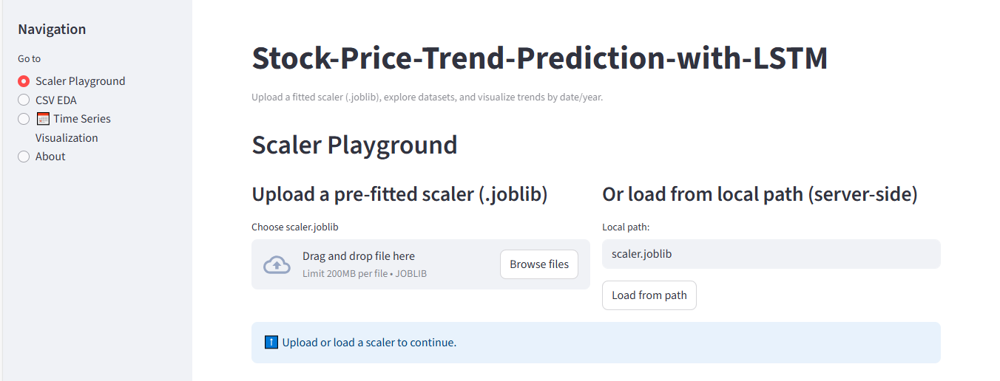

# 📈 Stock Price Trend Prediction with LSTM  

This project is a **Streamlit-based web app** that predicts stock price trends using **LSTM (Long Short-Term Memory) neural networks**.  
It also includes a **Scaler Playground + Quick EDA** tool to explore datasets and apply saved scalers (`.joblib`/`.pkl`).  

🔗 **Check out the live app here:** [Stock Price Trend Prediction with LSTM](https://stock-price-trend-prediction-with-lstm-nnddxr3qe5z8kwxjqr9ddf.streamlit.app/)  

---

## 🚀 Features  

- Upload stock price datasets (`CSV`)  
- Perform **Quick Exploratory Data Analysis (EDA)**  
- Apply a **pre-fitted scaler** (`StandardScaler`, `MinMaxScaler`, etc.)  
- Enter custom feature values to see scaled results  
- Visualize stock prices over **time (by Date & Year)**  
- Predict **future stock price trends** using LSTM  

---

## 🛠️ Tech Stack  

- **Python 3.9+**  
- **Streamlit** – for interactive UI  
- **Scikit-learn** – for scaling  
- **TensorFlow / Keras** – for LSTM model  
- **Pandas & Matplotlib** – for data handling & visualization  
- **Joblib / Pickle** – for saving & loading scalers  

---

## 📂 Project Structure  

📦 stock-price-prediction
┣ 📜 app.py # Streamlit main app
┣ 📜 scaler.joblib # Example pre-trained scaler
┣ 📜 requirements.txt # Dependencies
┣ 📜 README.md # Project documentation
┗ 📂 data # Sample datasets


## ▶️ How to Run Locally  

1. Clone the repository  
   ```bash
   git clone https://github.com/your-username/stock-price-prediction.git
   cd stock-price-prediction
Create & activate a virtual environment


python -m venv venv
source venv/bin/activate   # On Mac/Linux
venv\Scripts\activate      # On Windows
Install dependencies


pip install -r requirements.txt
Run the Streamlit app

streamlit run app.py

## 📊 Example Usage
1. Upload a dataset (.csv)

2. Load a pre-trained scaler (.joblib or .pkl)

3. Explore stock price trends with visualizations

4. Predict future stock prices using LSTM

## 🌐 Live Demo
👉 Try it out here: [Stock Price Trend Prediction with LSTM](https://stock-price-trend-prediction-with-lstm-nnddxr3qe5z8kwxjqr9ddf.streamlit.app)

## 📧 Contact
For questions or collaboration, feel free to reach out:

Author: Sudipta Mitra

Email: sudiptamitra945@gmail.com

GitHub: [Sudipta Mitra](https://github.com/Sudipta-Mitra)
